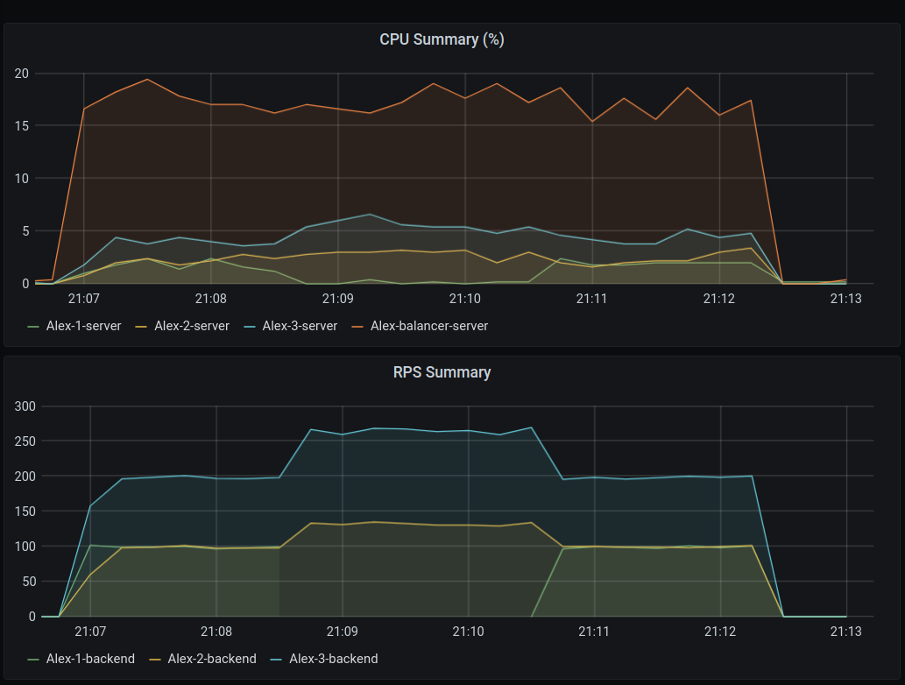

# Описание
Есть 4 сервера. Один из них - _балансировщик_, остальные - _бэкенды_.  

# Требования для запуска
Сначала вам нужно несколько серверов, работающих на Ubuntu 18.04.4 **(на других системах я не тестировал!!!)** .  
Как только они у вас повяились, то следуйте дальнейшим инстркуциям

## Общее для всех серверов
- Установить docker по [инструкции](https://docs.docker.com/engine/install/ubuntu/)
- Установить docker-compose по [инструкции](https://docs.docker.com/compose/install/)
- Склонировать куда-нибудь на сервере этот репозиторий

## Для бэкэнда
- Установить golang по [инструкции](https://golang.org/doc/install)

## Для балансировщика
- Изменить `nginx.conf`, добавив или убрав из него адреса бэкендов
- Изменить `prometheus.yaml`, добавив или убрав из него адреса бэкендов.  
Всё, где написано Alex-x-backend - это golang сервер, с которого собираются RPS  
Всё, где написано Alex-x-server - это сам физический сервер, с которого собираются данные о загрузке CPU  

# Запуск

## Запсук бэкенда
- на сервере зайти в папку с репозиторием

- перейти в папку с бэкендом  
`cd ./backend`

- запустить Node Exporter как демона  
`sudo docker-compose up -d` 

- скачать все зависимости  
`go get ./...`

- скомпилировать программу  
`go build .`

- запустить бэкенд как демона (вы сможете работать с терминалом,  
 но все логи сервер будет выплёвывать туда же)  
 `./Highload_2020_2_load_balancing &`

## Запсук балансировщика
- на сервере зайти в папку с репозиторием

- перейти в папку с бэкендом  
`cd ./balancer`

- запустить в фоне контейнеры с Nginx, Node Exporter, Prometheus, Grafana  
`sudo docker-compose up -d`

- чтобы самим не строить графики, возмите `grafana_dashboard.json` и сделайте [импорт](https://grafana.com/docs/grafana/latest/dashboards/export-import/) дашбоарда в Grafana

## Остановка
- выключить контейнеры на балансировщике (вы должны находится в папке balancer/)  
`sudo docker-compose stop`

- выключить контейнеры на бэкенде (вы должны находится в папке backend/)  
`sudo docker-compose stop`

- найти PID бэкенда  
`ps -e | grep "Highload_2020_2"`

- выключить его  
`kill <BACKEND_PID>`

# Результаты нагрузочного тестирования
Тестировалось с помощью `ab -c 100 -n 1000000 http://localhost/`  
У каждого сервера было по 1 ядру, 2Гб RAM, 10Гб SSD

Порядок:  
- запускается нагрузка
- один из бэкендов отключается отключается
- нагрузка перераспределяется на другие бэкенды
- бэкенд снова запускается
- через некоторое время на него тоже начинают прилетать запросы

 
